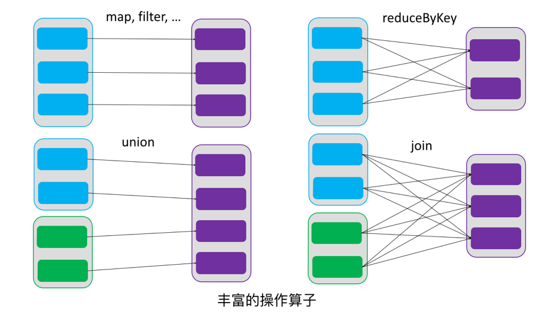
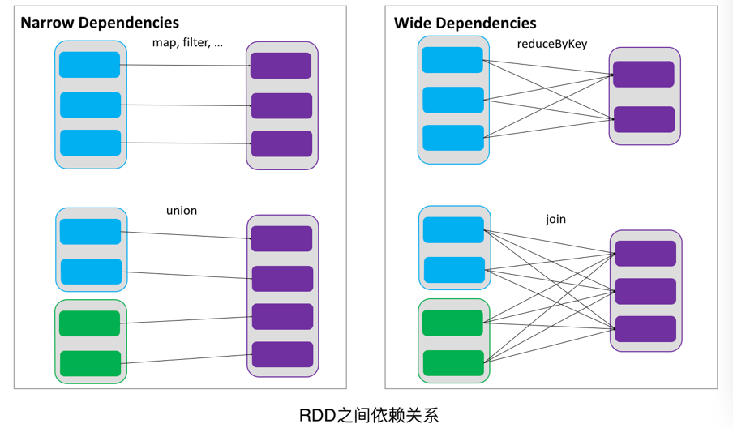
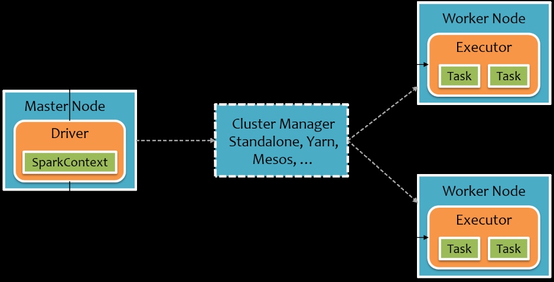

# SparkCore

## 一、RDD概述

### 1.1 什么是RDD
RDD（Resilient Distributed Dataset）叫做`弹性分布式数据集`，是Spark中最基本的数据抽象。代码中是一个抽象类，它代表一个`弹性的、不可变、可分区、里面的元素可并行计算`的集合。

### 1.2 RDD的属性
（1）一组分区（Partition），表示数据可分区，即数据集的基本组成单位；
（2）一个计算每个分区的函数，一个分区形成一个任务；
（3）RDD之间的依赖关系；
（4）一个Partitioner，即RDD的分片函数，RDD默认使用`哈希分区`；
（5）一个列表，存储存取每个Partition的优先位置（preferred location）。即数据文件的存储路径，便于判断将计算任务移动到哪个节点。`移动计算不移动数据`

### 1.3 RDD的特点
RDD表示`只读的分区`的数据集，对RDD进行改动，只能通过RDD的`转换`操作，`由一个RDD得到一个新的RDD`，新的RDD包含了从其他RDD衍生所必需的信息。RDDs之间存在依赖，RDD的执行是按照血缘关系延时计算的。如果血缘关系较长，可以通过持久化RDD来切断血缘关系。

#### 1.3.1 弹性
`存储`的弹性：内存与磁盘的自动切换；
`容错`的弹性：数据丢失可以自动恢复，此处指Task内部，通过依赖关系恢复；
`计算`的弹性：计算出错重试机制，此处指Task失败后的任务重新调度；
`分片`的弹性：可根据需要重新分片，以此调整并行度及分区处理的数据大小。

#### 1.3.2 分区
RDD逻辑上是分区的，每个分区的数据是抽象存在的，计算的时候会通过一个compute函数得到每个分区的数据。如果RDD是通过已有的文件系统构建，则compute函数是读取指定文件系统中的数据，如果RDD是通过其他RDD转换而来，则compute函数是执行转换逻辑将其他RDD的数据进行转换。

#### 1.3.3 只读
RDD是`只读`的，要想改变RDD中的数据，只能在现有的RDD基础上`创建新的`RDD。
由一个RDD转换到另一个RDD，可以通过丰富的操作算子实现，不再像MapReduce那样只能写map和reduce了。
RDD的操作算子包括两类，一类叫做`Transformations`，它是用来将RDD进行`转化`，构建RDD的`血缘关系`；另一类叫做`Actions`，它是用来`触发RDD的计算`，得到RDD的相关计算结果或者将RDD保存到文件系统中。


#### 1.3.4 依赖
RDDs通过操作算子进行转换，转换得到的新RDD包含了从其他RDDs衍生所必需的信息，RDDs之间维护着这种血缘关系，也称之为依赖。如下图所示，依赖包括两种，一种是`窄依赖`，RDDs之间分区是`一一对应`的，另一种是`宽依赖`，下游RDD的每个分区与上游RDD(也称之为父RDD)的每个分区都有关，是`多对多`的关系，`宽依赖会产生shuffle`。


#### 1.3.5 缓存
如果在应用程序中`多次使用同一个RDD`，可以将该RDD缓存起来，该RDD只有在第一次计算的时候会根据血缘关系得到分区的数据，在后续其他地方用到该RDD的时候，会直接从缓存处取而不用再根据血缘关系计算，这样就`加速后期的重用`。
如下图所示，RDD-1经过一系列的转换后得到RDD-n并保存到hdfs，RDD-1在这一过程中会有个中间结果，如果将其`缓存到内存`，那么在随后的RDD-1转换到RDD-m这一过程中，就不会计算其之前的RDD-0了。


#### 1.3.6 CheckPoint
虽然RDD的血缘关系天然地可以实现容错，当RDD的某个分区数据失败或丢失，可以通过血缘关系重建。但是对于长时间迭代型应用来说，随着迭代的进行，RDDs之间的血缘关系会越来越长，一旦在后续迭代过程中出错，则需要通过非常长的血缘关系去重建，势必影响性能。为此，RDD支持`checkpoint将数据保存到持久化的存储中`，这样就可以切断之前的血缘关系，因为checkpoint后的RDD不需要知道它的父RDDs了，它可以从checkpoint处拿到数据。
`缓存在内存，CheckPoint在硬盘`。
`Spark默认不使用缓存和CheckPoint`。

## 二、RDD编程

### 2.1 编程模型
在Spark中，RDD被表示为对象，通过对象上的方法调用来对RDD进行转换。经过一系列的`transformations`定义RDD之后，就可以调用`actions`触发RDD的计算，action可以是`向应用程序返回结果`(count, collect等)，或者是`向存储系统保存数据`(saveAsTextFile等)。
在Spark中，只有遇到action，才会执行RDD的计算`(即延迟计算)`，这样在运行时可以通过管道的方式传输多个转换。
要使用Spark，开发者需要编写一个Driver程序，它被提交到集群以调度运行Worker。`Driver中定义了一个或多个RDD，并调用RDD上的action，Worker则执行RDD分区计算任务`。

transformations定义RDD的血缘关系，actions触发RDD的计算，即`transformations是懒执行的`。

### 2.2 RDD的创建
在Spark中创建RDD的创建方式可以分为三种：从集合中创建RDD；从外部存储创建RDD；从其他RDD创建。

#### 2.2.1 从集合中创建
从集合中创建RDD，Spark主要提供了两种函数：`parallelize`和`makeRDD`
1）使用parallelize()从集合创建
```scala
scala> val rdd = sc.parallelize(Array(1,2,3,4,5,6,7,8))
rdd: org.apache.spark.rdd.RDD[Int] = ParallelCollectionRDD[0] at parallelize at <console>:24
```
2）使用makeRDD()从集合创建
```scala
scala> val rdd1 = sc.makeRDD(Array(1,2,3,4,5,6,7,8))
rdd1: org.apache.spark.rdd.RDD[Int] = ParallelCollectionRDD[1] at makeRDD at <console>:24
```
makeRDD底层调用的还是parallelize。

#### 2.2.2 从外部文件系统创建
包括本地的文件系统，还有所有Hadoop支持的数据集，比如HDFS、Cassandra、HBase等，第4章详细介绍。

#### 2.2.3 从其他RDD创建
即通过转换算子创建新的RDD。

### 2.3 RDD的转换
`RDD整体上分为Value类型和Key-Value类型`，KV类型可认为是特殊的V类型，可以使用V类型的算子，反之则不可。

#### 2.3.1 Value类型

##### 2.3.1.1 map(func)
1. 作用：返回一个新的RDD，该RDD由每一个输入元素经过func函数转换后组成
2. 需求：创建一个1-10数组的RDD，将所有元素*2形成新的RDD
（1）创建
```scala
scala> var source  = sc.parallelize(1 to 10)
source: org.apache.spark.rdd.RDD[Int] = ParallelCollectionRDD[8] at parallelize at <console>:24
```
（2）打印
```scala
scala> source.collect()
res7: Array[Int] = Array(1, 2, 3, 4, 5, 6, 7, 8, 9, 10)
```
（3）将所有元素*2
```scala
scala> val mapadd = source.map(_ * 2)
mapadd: org.apache.spark.rdd.RDD[Int] = MapPartitionsRDD[9] at map at <console>:26
```
（4）打印最终结果
```scala
scala> mapadd.collect()
res8: Array[Int] = Array(2, 4, 6, 8, 10, 12, 14, 16, 18, 20)
```
Spark源码中withScope方法用于WebUI的DAG图的生成。

##### 2.3.1.2 mapPartitions(func)
1. 作用：类似于map，但独立地`在RDD的每一个分片上运行`，因此在类型为T的RDD上运行时，func的函数类型必须是Iterator[T] => Iterator[U]。
假设有N个元素，有M个分区，那么map的函数的将被调用N次，而mapPartitions被调用M次，`一个函数一次处理所有分区`。
2. 需求：创建一个RDD，使每个元素*2组成新的RDD
（1）创建一个RDD
```scala
scala> val rdd = sc.parallelize(Array(1,2,3,4))
rdd: org.apache.spark.rdd.RDD[Int] = ParallelCollectionRDD[4] at parallelize at <console>:24
```
（2）使每个元素*2组成新的RDD
```scala
scala> rdd.mapPartitions(_.map(_*2))
res3: org.apache.spark.rdd.RDD[Int] = MapPartitionsRDD[6] at mapPartitions at <console>:27
```
（3）打印新的RDD
```scala
scala> res3.collect
res4: Array[Int] = Array(2, 4, 6, 8)
```
会将一个分区的数据存入一个迭代器中，故当分区数据量太大时，可能发生OOM。

##### 2.3.1.3 mapPartitionsWithIndex(func)
1. 作用：类似于mapPartitions，但func带有`一个整数参数表示分片的索引值`，因此在类型为T的RDD上运行时，func的函数类型必须是(Int, Interator[T]) => Iterator[U]；
2. 需求：创建一个RDD，使每个元素跟所在分区形成一个元组组成一个新的RDD

（1）创建一个RDD
```scala
scala> val rdd = sc.parallelize(Array(1,2,3,4))
rdd: org.apache.spark.rdd.RDD[Int] = ParallelCollectionRDD[4] at parallelize at <console>:24
```
（2）使每个元素跟所在分区形成一个元组组成一个新的RDD
```scala
scala> val indexRdd = rdd.mapPartitionsWithIndex((index,items)=>(items.map((index,_))))
indexRdd: org.apache.spark.rdd.RDD[(Int, Int)] = MapPartitionsRDD[5] at mapPartitionsWithIndex at <console>:26
```
（3）打印新的RDD
```scala
scala> indexRdd.collect
res2: Array[(Int, Int)] = Array((0,1), (0,2), (1,3), (1,4))
```

##### 2.3.1.4 map()和mapPartition()的区别
1. map()：每次处理一条数据。
2. mapPartition()：每次处理一个分区的数据，这个分区的数据处理完后，原RDD中分区的数据才能释放，可能导致OOM。
3. 开发指导：当内存空间较大的时候建议使用mapPartition()，以提高处理效率。

*scala中 _ 的使用：*
1. 省略的参数只使用一次；
2. 就近原则：即括号，对_最近的括号进行补充扩展。
eg：(_+1)\*2 扩展后为： (x=>x+1)\*2

*parallelize的分区规则：*
1. 分区数：使用parallelize函数创建RDD，用户未定义分区数时，会先去读取spark.default.parallelism参数配置的默认分区数，如未配置，则local模式使用本机最大核数，集群模式使用本机最大核数与2的较大值作为分区数。
2. 分区规则：调用slice()方法，底层调用positions()方法，分区号从0开始，公式：`分区号*数组长度/分区`并数转化为整数，获取每个分区所包含的数组角标，左闭右开。

##### 2.3.1.5 flatMap(func)
1. 作用：类似于map，但是每一个输入元素可以被映射为0或多个输出元素（所以func应该`返回一个序列`，而不是单一元素）
2. 需求：创建一个元素为1-5的RDD，运用flatMap创建一个新的RDD，新的RDD为原RDD的每个元素的扩展（1->1,2->1,2……5->1,2,3,4,5）
（1）创建
```scala
scala> val sourceFlat = sc.parallelize(1 to 5)
sourceFlat: org.apache.spark.rdd.RDD[Int] = ParallelCollectionRDD[12] at parallelize at <console>:24
```
（2）打印
```scala
scala> sourceFlat.collect()
res11: Array[Int] = Array(1, 2, 3, 4, 5)
```
（3）根据原RDD创建新RDD（1->1,2->1,2……5->1,2,3,4,5）
```scala
scala> val flatMap = sourceFlat.flatMap(1 to _)
flatMap: org.apache.spark.rdd.RDD[Int] = MapPartitionsRDD[13] at flatMap at <console>:26
```
（4）打印新RDD
```scala
scala> flatMap.collect()
res12: Array[Int] = Array(1, 1, 2, 1, 2, 3, 1, 2, 3, 4, 1, 2, 3, 4, 5)
```

##### 2.3.1.6 glom
1. 作用：`将每一个分区形成一个数组`，形成新的RDD类型时RDD[Array[T]]
2. 需求：创建一个4个分区的RDD，并将每个分区的数据放到一个数组

（1）创建
```scalascala> val rdd = sc.parallelize(1 to 16,4)
rdd: org.apache.spark.rdd.RDD[Int] = ParallelCollectionRDD[65] at parallelize at <console>:24
```
（2）将每个分区的数据放到一个数组并收集到Driver端打印
```scala
scala> rdd.glom().collect()
res25: Array[Array[Int]] = Array(Array(1, 2, 3, 4), Array(5, 6, 7, 8), Array(9, 10, 11, 12), Array(13, 14, 15, 16))
```

##### 2.3.1.7 groupBy(func)
1. 作用：分组，按照`传入函数的返回值`进行分组。将相同的key对应的值放入一个迭代器。
2. 需求：创建一个数组RDD，按照奇偶数进行分组。

（1）创建
```scala
scala> val rdd = sc.parallelize(1 to 4)
rdd: org.apache.spark.rdd.RDD[Int] = ParallelCollectionRDD[65] at parallelize at <console>:24
```
（2）按照元素模以2的值进行分组
```scala
scala> val group = rdd.groupBy(_%2)
group: org.apache.spark.rdd.RDD[(Int, Iterable[Int])] = ShuffledRDD[2] at groupBy at <console>:26
```
（3）打印结果
```scala
scala> group.collect
res0: Array[(Int, Iterable[Int])] = Array((0,CompactBuffer(2, 4)), (1,CompactBuffer(1, 3)))
```

##### 2.3.1.8 filter(func) 
1. 作用：过滤。返回一个新的RDD，该RDD由经过func函数计算后返回值为true的输入元素组成。
2. 需求：创建一个RDD（由字符串组成），过滤出一个新RDD（包含”xiao”子串）

（1）创建
```scala
scala> var sourceFilter = sc.parallelize(Array("xiaoming","xiaojiang","xiaohe","dazhi"))
sourceFilter: org.apache.spark.rdd.RDD[String] = ParallelCollectionRDD[10] at parallelize at <console>:24
```
（2）打印
```scala
scala> sourceFilter.collect()
res9: Array[String] = Array(xiaoming, xiaojiang, xiaohe, dazhi)
```
（3）过滤出含” xiao”子串的形成一个新的RDD
```scala
scala> val filter = sourceFilter.filter(_.contains("xiao"))
filter: org.apache.spark.rdd.RDD[String] = MapPartitionsRDD[11] at filter at <console>:26
```
（4）打印新RDD
```scala
scala> filter.collect()
res10: Array[String] = Array(xiaoming, xiaojiang, xiaohe)
```

##### 2.3.1.9 sample(withReplacement, fraction, seed)
1. 作用：以指定的随机种子随机抽样出数量为fraction的数据，withReplacement表示是抽出的数据是否放回，true为有放回的抽样，false为无放回的抽样，seed用于指定随机数生成器种子。
2. 需求：创建一个RDD（1-10），从中选择放回和不放回抽样

（1）创建RDD
```scala
scala> val rdd = sc.parallelize(1 to 10)
rdd: org.apache.spark.rdd.RDD[Int] = ParallelCollectionRDD[20] at parallelize at <console>:24
```
（2）打印
```scala
scala> rdd.collect()
res15: Array[Int] = Array(1, 2, 3, 4, 5, 6, 7, 8, 9, 10)
```
（3）放回抽样
```scala
scala> var sample1 = rdd.sample(true,0.4,2)
sample1: org.apache.spark.rdd.RDD[Int] = PartitionwiseSampledRDD[21] at sample at <console>:26
```
（4）打印放回抽样结果
```scala
scala> sample1.collect()
res16: Array[Int] = Array(1, 2, 2, 7, 7, 8, 9)
```
（5）不放回抽样
```scala
scala> var sample2 = rdd.sample(false,0.2,3)
sample2: org.apache.spark.rdd.RDD[Int] = PartitionwiseSampledRDD[22] at sample at <console>:26
```
（6）打印不放回抽样结果
```scala
scala> sample2.collect()
res17: Array[Int] = Array(1, 9)
```
抽样主要用于缩小数据集进行样本测试：
1. 不放回抽样：withReplacement传false，fraction指元素被抽出来的概率（0-1），对每个元素都只有是否被抽出两种可能，伯努利分布；
2. 放回抽样：withReplacement传true，fraction指元素被抽出来的次数，波峰分布；
3. 参数种子通常传当前的时间戳。

##### 2.3.1.10 distinct([numTasks]))
1. 作用：对源RDD进行去重后返回一个新的RDD，numTasks为并行度。
2. 需求：创建一个RDD，使用distinct()对其去重。

（1）创建一个RDD
```scala
scala> val distinctRdd = sc.parallelize(List(1,2,1,5,2,9,6,1))
distinctRdd: org.apache.spark.rdd.RDD[Int] = ParallelCollectionRDD[34] at parallelize at <console>:24
```
（2）对RDD进行去重
```scala
scala> val unionRDD = distinctRdd.distinct()
unionRDD: org.apache.spark.rdd.RDD[Int] = MapPartitionsRDD[37] at distinct at <console>:26
```
（3）打印去重后生成的新RDD
```scala
scala> unionRDD.collect()
res20: Array[Int] = Array(1, 9, 5, 6, 2)
```
（4）对RDD
```scala
scala> val unionRDD = distinctRdd.distinct(2)
unionRDD: org.apache.spark.rdd.RDD[Int] = MapPartitionsRDD[40] at distinct at <console>:26
```
（5）打印去重后生成的新RDD
```scala
scala> unionRDD.collect()
res21: Array[Int] = Array(6, 2, 1, 9, 5)
```
实现原理：将元素转换为(x,null)，利用reduceByKey去重，最后只输出key
```scala
map(x => (x, null)).reduceByKey((x, y) => x, numPartitions).map(_._1)
```

##### 2.3.1.11 coalesce(numPartitions, [isShuffle])
1. 作用：*`缩减分区数`*，用于大数据集过滤后，提高小数据集的执行效率，Shuffle参数默认为false，即默认不产生Shuffle。
2. 需求：创建一个4个分区的RDD，对其缩减分区

（1）创建一个RDD
```scala
scala> val rdd = sc.parallelize(1 to 16,4)
rdd: org.apache.spark.rdd.RDD[Int] = ParallelCollectionRDD[54] at parallelize at <console>:24
```
（2）查看RDD的分区数
```scala
scala> rdd.partitions.size
res20: Int = 4
```
（3）对RDD重新分区
```scala
scala> val coalesceRDD = rdd.coalesce(3)
coalesceRDD: org.apache.spark.rdd.RDD[Int] = CoalescedRDD[55] at coalesce at <console>:26
```
（4）查看新RDD的分区数
```scala
scala> coalesceRDD.partitions.size
res21: Int = 3
```

##### 2.3.1.12 repartition(numPartitions)
1. 作用：根据分区数，重新通过网络随机洗牌所有数据，实现`重新分区`。底层调用coalesce()，且Shuffle参数为true，即本算子必然产生Shuffle。
2. 需求：创建一个4个分区的RDD，对其重新分区

（1）创建一个RDD
```scala
scala> val rdd = sc.parallelize(1 to 16,4)
rdd: org.apache.spark.rdd.RDD[Int] = ParallelCollectionRDD[56] at parallelize at <console>:24
```
（2）查看RDD的分区数
```scala
scala> rdd.partitions.size
res22: Int = 4
```
（3）对RDD重新分区
```scala
scala> val rerdd = rdd.repartition(2)
rerdd: org.apache.spark.rdd.RDD[Int] = MapPartitionsRDD[60] at repartition at <console>:26
```
（4）查看新RDD的分区数
```scala
scala> rerdd.partitions.size
res23: Int = 2
```

##### 2.3.1.13 coalesce和repartition的区别
1. coalesce重新分区，可以选择是否进行shuffle过程。由参数shuffle: Boolean = false/true决定，默认不进行shuffle。
2. repartition实际上是调用的coalesce，默认进行shuffle。源码如下：
```scala
def repartition(numPartitions: Int)(implicit ord: Ordering[T] = null): RDD[T] = withScope {
  coalesce(numPartitions, shuffle = true)
}
```

##### 2.3.1.14 sortBy(func,[ascending], [numTasks])
1. 作用；使用func先对数据进行处理，按照处理后的数据比较结果排序，默认为正序。
2. 需求：创建一个RDD，按照不同的规则进行排序

（1）创建一个RDD
```scala
scala> val rdd = sc.parallelize(List(2,1,3,4))
rdd: org.apache.spark.rdd.RDD[Int] = ParallelCollectionRDD[21] at parallelize at <console>:24
```
（2）按照自身大小排序
```scala
scala> rdd.sortBy(x => x).collect()
res11: Array[Int] = Array(1, 2, 3, 4)
```
（3）按照与3余数的大小排序
```scala
scala> rdd.sortBy(x => x%3).collect()
res12: Array[Int] = Array(3, 4, 1, 2)
```

##### 2.3.1.15 pipe(command, [envVars])
1. 作用：管道，针对每个分区，都执行一个shell脚本，返回输出的RDD。
注意：脚本需要放在Worker节点可以访问到的位置
2. 需求：编写一个脚本，使用管道将脚本作用于RDD上。

（1）编写一个脚本
```shell
#!/bin/sh
echo "AA"
while read LINE; do
   echo ">>>"${LINE}
done
```
（2）创建一个只有一个分区的RDD
```scala
scala> val rdd = sc.parallelize(List("hi","Hello","how","are","you"),1)
rdd: org.apache.spark.rdd.RDD[String] = ParallelCollectionRDD[50] at parallelize at <console>:24
```
（3）将脚本作用该RDD并打印
```scala
scala> rdd.pipe("/opt/module/spark/pipe.sh").collect()
res18: Array[String] = Array(AA, >>>hi, >>>Hello, >>>how, >>>are, >>>you)
```
（4）创建一个有两个分区的RDD
```scala
scala> val rdd = sc.parallelize(List("hi","Hello","how","are","you"),2)
rdd: org.apache.spark.rdd.RDD[String] = ParallelCollectionRDD[52] at parallelize at <console>:24
```
（5）将脚本作用该RDD并打印
```scala
scala> rdd.pipe("/opt/module/spark/pipe.sh").collect()
res19: Array[String] = Array(AA, >>>hi, >>>Hello, AA, >>>how, >>>are, >>>you)
```
