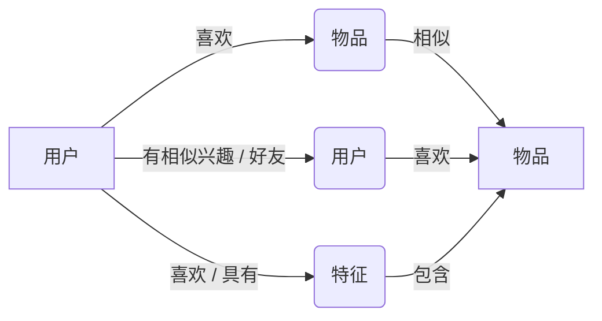
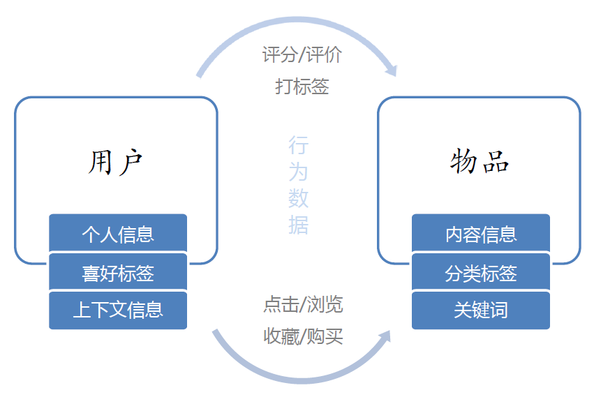

# 01_推荐系统简介

---
- 推荐系统是信息过载所采用的措施，面对海量的数据信息，从中快速推荐出符合用户特的物品
- 解决一些人的“选择恐惧症”；面向没有明确需求的人
- 解决如何从大量信息中找到自己感兴趣的信息
- 解决如何让自己生产的信息脱颖而出，受到大众的喜爱

---
## 一、推荐系统目的
1. 要素
    - 以网站作为基础、依托的业务系统
    - 以用户作为参与方
    - 以系统中能够看到的商品作为内容
2. 目的
    - 让用户更快更好的获取到自己需要的内容
    - 让内容更快更好的推送给喜欢它的用户
    - 让 网站（平台）更有效的保留用户资源
## 二、推荐系统应用
+ 应用：
    - 电商：淘宝、京东、亚马逊（个性化推荐）
    - 电影视频：网飞（个性化推荐 / Netflix prize）
    - 个性化音乐：潘多拉（重用率高、浏览耗费精力少）
    - 个性化阅读、新闻：谷歌阅读、头条
    - 社交网络：Facebook、Twitter、微信、微博
    - 个性化广告：谷歌、Facebook
## 三、推荐系统基本思想
1. 三种基本思想
    - 知你所想：利用用户和物品的特征信息，给用户推荐那些具有用户喜欢的特征的物品
    - 物以类聚：利用用户喜欢过的物品，给用户推荐与他喜欢过的物品相似的物品
    - 人以群分：利用和用户相似的其他用户，给用户推荐那些和他们兴趣爱好相似的其他用户喜欢的物品
2. 图示

## 四、推荐系统的数据分析
1. 用户
    - 个人信息：性别、年龄
    - 喜好标签
    - 上下文信息：浏览器Cookie
2. 物品
    - 内容信息：物品描述
    - 分类标签
    - 关键词
3. 用户行为数据
    - 显式反馈数据：对物品的评分、评论
    - 隐式反馈数据：浏览、收藏、购买
4. 图示

## 五、推荐系统分类
1. 根据实时性分类
    - 离线推荐
    - 实时推荐
2. 根据是否个性化分类
    - 基于统计的推荐
    - 个性化推荐
3. 根据推荐原则分类
    - 基于相似度的推荐
    - 基于知识的推荐
    - 基于模型的推荐
4. 根据数据源分类
    - 基于人口统计学的推荐
    - 基于内容的推荐
    - 基于协同过滤的推荐
5. 